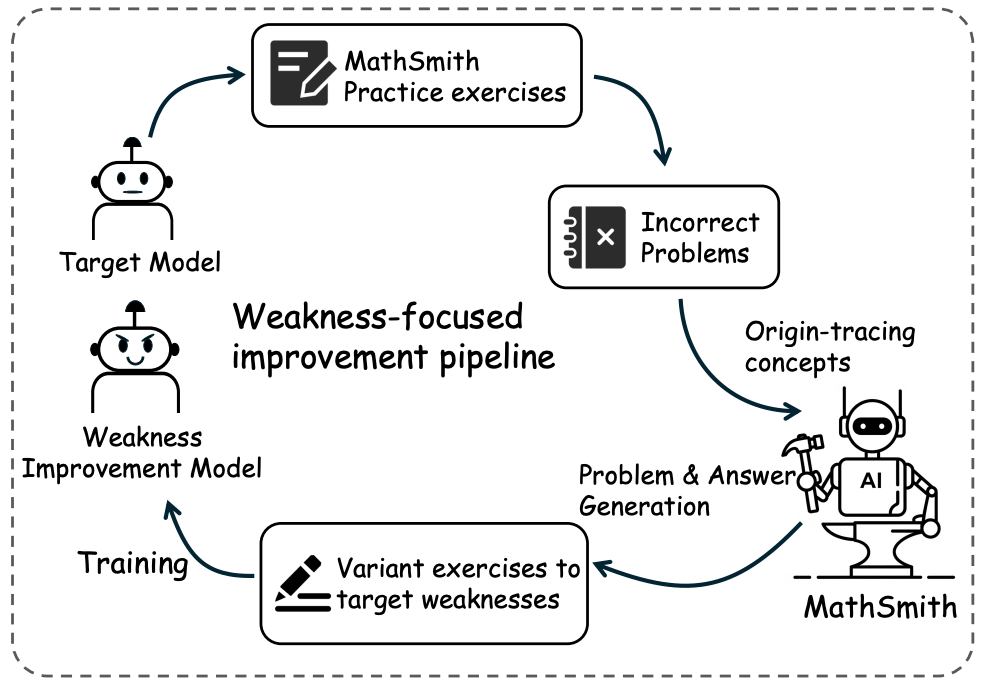
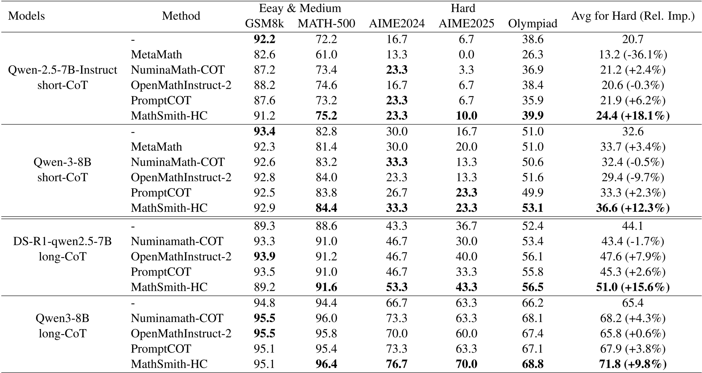
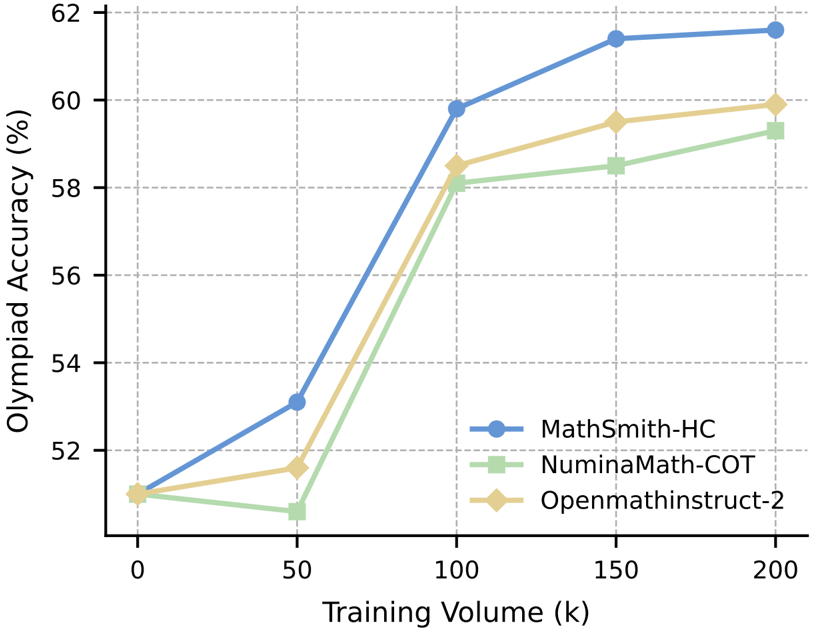
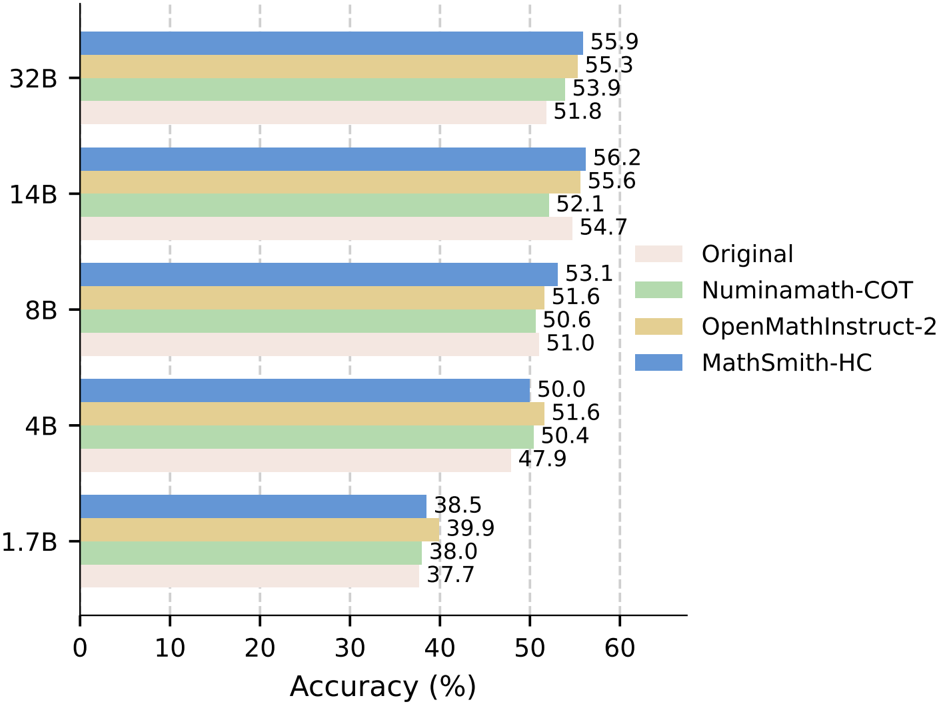

# MathSmith

**MathSmith: Towards Extremely Hard Mathematical Reasoning by Forging Synthetic Problems with a Reinforced Policy**

[](https://arxiv.org/abs/2508.05592)
[](LICENSE)
[]()
[](https://jasaxion.github.io/MathSmith_ProjectPage/)

## Overview

MathSmith is a framework for enhancing mathematical reasoning capabilities of large language models by generating challenging synthetic problems from scratch. Unlike methods that modify existing problems, MathSmith creates novel problems through a reinforced policy, ensuring diversity and scalability.


## Resources

### 🧠 Problem Synthesizers
- [MathSmith-HC-Qwen3-8B](https://huggingface.co/Jasaxion/MathSmith-HC-Problem-Synthesizer-Qwen3-8B): complexity + consistency reward
- [MathSmith-Hard-Qwen3-8B](https://huggingface.co/Jasaxion/MathSmith-Hard-Problem-Synthesizer-Qwen3-8B): complexity-only reward

### 📘 Datasets
- [MathSmith-HC-Problems](https://huggingface.co/datasets/Jasaxion/MathSmith-HC-Problems)  
- [MathSmith-Hard-Problems](https://huggingface.co/datasets/Jasaxion/MathSmith-Hard-Problems)  
- [HC + ShortCoT Solutions](https://huggingface.co/datasets/Jasaxion/MathSmith-HC-Solution-Generation-ShortCoT-Qwen3-30B-A3B)  
- [HC + LongCoT Solutions](https://huggingface.co/datasets/Jasaxion/MathSmith-HC-Solution-Generation-LongCoT-Qwen3-30B-A3B)  

### 🔧 SFT Models
ShortCoT (Qwen3 series):
[`1.7B`](https://huggingface.co/Jasaxion/MathSmith-HC-Qwen3-1_7B-ShortCoT) | [`8B`](https://huggingface.co/Jasaxion/MathSmith-HC-Qwen3-8B) | [`14B`](https://huggingface.co/Jasaxion/MathSmith-HC-Qwen3-14B-ShortCoT) | [`32B`](https://huggingface.co/Jasaxion/MathSmith-HC-Qwen3-32B-ShortCoT)  
LongCoT:
[`Qwen3-8B`](https://huggingface.co/Jasaxion/MathSmith-Qwen3-8B-LongCoT) | [`DS-Qwen-7B`](https://huggingface.co/Jasaxion/MathSmith-DS-Qwen-7B-LongCoT)


## Pipeline

The MathSmith framework consists of four main stages:

1. **Concept Collection**: Randomly sample concept–explanation pairs from [PlanetMath](https://planetmath.org/) to ensure data independence.

2. **Supervised Fine-tuning (SFT)**: Train the model on collected concept–explanation pairs to establish foundational understanding.

3. **Reinforcement Learning (RL)**: Optimize the model using GRPO with rewards based on:
   - Structural validity
   - Reasoning complexity  
   - Answer consistency

4. **Weakness-Focused Self-Improvement**: Iteratively identify and address model weaknesses by generating targeted problem variants.


## Quick Start

### Installation

```bash
git clone https://github.com/Jasaxion/MathSmith.git
cd MathSmith
pip install -r requirements.txt
```

### Data Collection

Collect concept–explanation pairs from PlanetMath:

```bash
cd data_collect/planetmath_process
# Follow instructions to process PlanetMath data
```

We have processed the concept-explanation pairs from PlanetMath and stored them in `./data_collect/sampled_concept/collect_planetmath_grouped_deduplicated.jsonl`

### Problem Generation

Generate mathematical problems using the trained model:

```bash
python QM_sampler.py
```

### Evaluation

Evaluate on benchmarks (GSM8K, MATH-500, AIME2024, AIME2025, OlympiadBench):

```bash
cd evaluate
bash eval.sh
```

### Self-Improvement

Run the weakness-focused improvement pipeline: [Instruction](https://github.com/Jasaxion/MathSmith/blob/main/self-improvement/README.md)



```bash
cd self-improvement
bash self_improve.sh
```

## Repository Structure

```
MathSmith/
├── data_collect/          # Concept collection and data processing
├── sft-stage/             # Supervised fine-tuning scripts
├── rl-stage/              # Reinforcement learning training
│   ├── train_script/      # RL training scripts
│   └── reward_func/       # Reward function implementations
├── answer_sampler/        # Answer generation for problems
├── evaluate/              # Evaluation scripts and benchmarks
├── self-improvement/      # Weakness-focused improvement pipeline
├── utils/                 # Utility functions
└── QM_sampler.py         # Problem generation script
```

### Training

If you want to start training a MathSmith framework's problem synthesis model from scratch, please complete two stages of training according to the following steps.

SFT Stage to get a MathSmith-cold-start model
```bash
cd sft-stage
# Configure MathSmith_Questioner-Qwen3-8B.yaml
# Run SFT training
```

RL Stage to custom reward and training a HC/Hard version.
```bash
cd rl-stage/train_script
bash rl_mathsmith.sh
```

## Results

MathSmith consistently outperforms baselines across five benchmarks under both short and long chain-of-thought settings:
- **Easy & Medium**: GSM8K, MATH-500
- **Hard**: AIME2024, AIME2025, OlympiadBench



 

## Citation

If you find this work useful, please cite:

```bibtex
@article{zhan2025mathsmith,
  title={MathSmith: Towards Extremely Hard Mathematical Reasoning by Forging Synthetic Problems with a Reinforced Policy},
  author={Zhan, Shaoxiong and Lai, Yanlin and Lu, Ziyu and Lin, Dahua and Yang, Ziqing and Tan, Fei},
  journal={arXiv preprint arXiv:2508.05592},
  year={2025}
}
```
